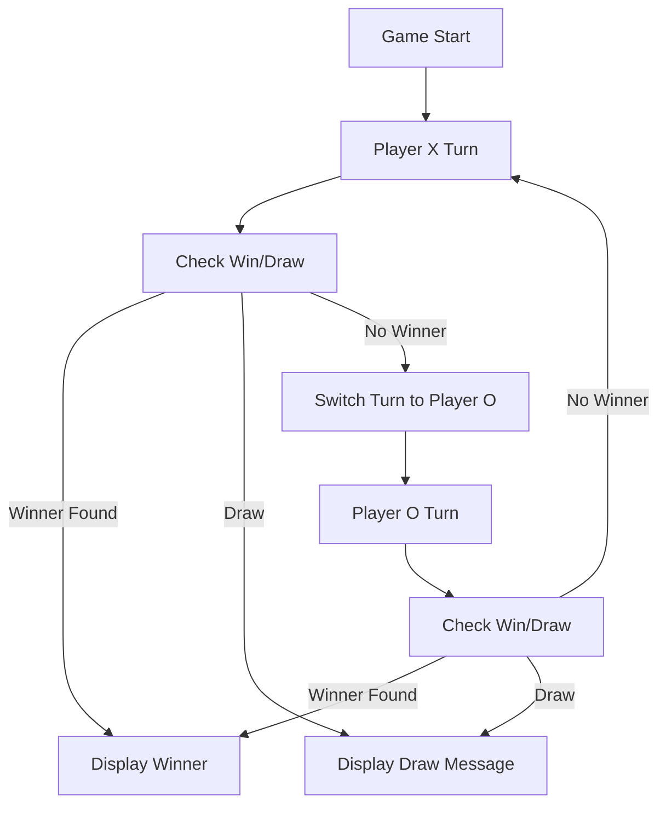
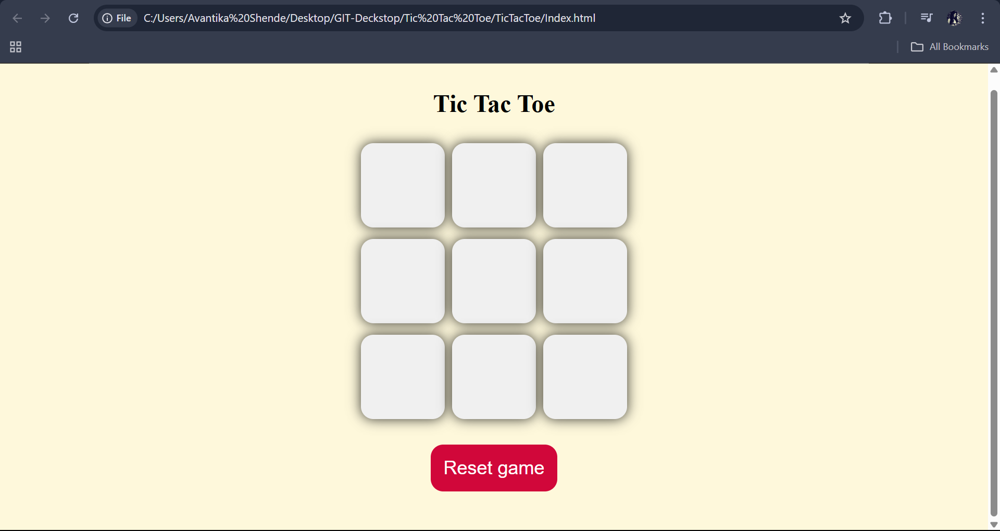
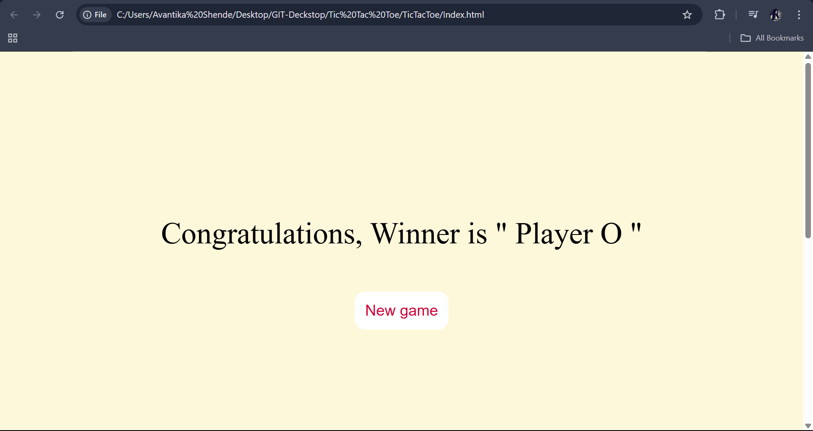
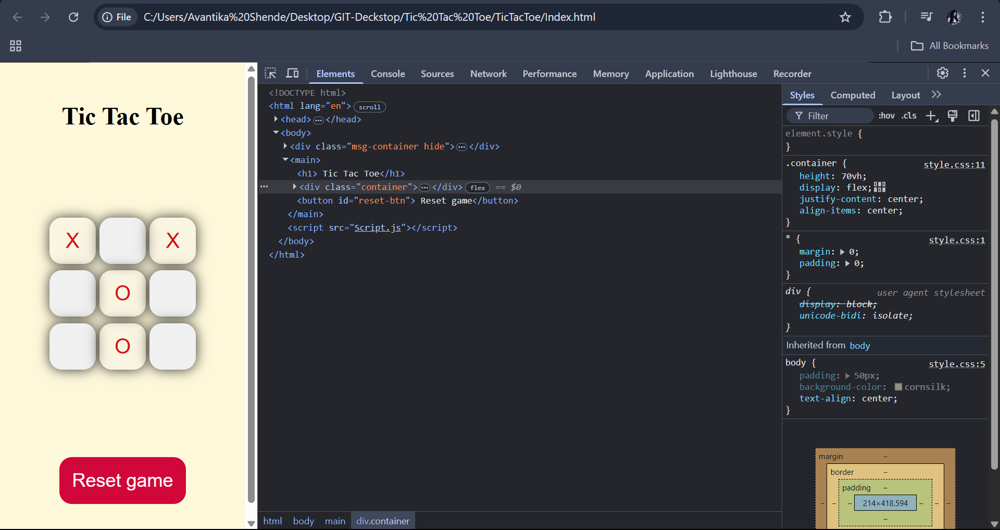

# 🎮 Tic-Tac-Toe Game

## 📝 Overview
This is a simple **Tic-Tac-Toe** game built using **HTML, CSS, and JavaScript**. The project focuses on **JavaScript event handling** and UI functionality. 

🔹 The game allows two players to take turns marking their spots on a **3x3 grid**. 
🔹 The winner is determined based on the classic Tic-Tac-Toe rules.
🔹 The UI is kept simple, with plans to enhance the design in the future. 

---

## 🎯 Features
✅ **One-Player Mode** – Play with a computer on the same device.  
✅ **Dynamic UI Updates** – Board updates automatically after each move.  
✅ **Win Detection** – The game checks for a winner or a draw after every move.  
✅ **Restart Button** – Reset the game anytime with a single click.  
✅ **Interactive Animations** – Smooth UI transitions for an engaging experience.  

---

## 📂 Project Folder Structure
Below is the project structure:

```
Tic-Tac-Toe-Game/
│── index.html         # Main HTML file
│── style.css          # CSS styles
│── script.js          # JavaScript logic
│── images/            # Contains images used in the project
│   ├── tic-tac-toe-logo.png
│── README.md          # Project documentation
```


## 🚀 Installation Instructions  

### 1️⃣ Clone this repository:  
```sh
git clone <[repository](https://github.com/28Avantika/TicTacToe.git)>
```  

### 2️⃣ Navigate to the project folder:  
```sh
cd Tic-Tac-Toe-Game
```

### 3️⃣ Open `index.html` in a web browser:  
```sh
start index.html   # Windows
open index.html    # macOS
xdg-open index.html # Linux
```

Alternatively, you can open it using **VS Code Live Server**:
1. Install the **Live Server** extension in VS Code.
2. Open the project folder in VS Code.
3. Right-click on `index.html` and select **"Open with Live Server"**.

---

## 🔄 Game Flow Diagram



---

## 🖼️ UI Preview
Below are some screenshots of the project:

### 🎮 Game Board  


### 🏆 Winning Screen & New Game Button  


### View


---

